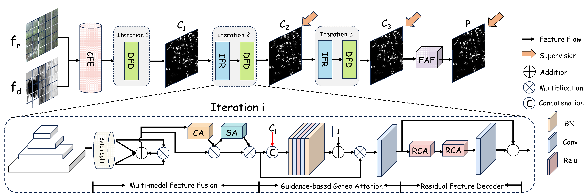

# Depth-Aware Concealed Crop Detection in Dense Agricultural Scenes (CVPR2024)

## Overview
- Our *ACOD-12K*
  


- Our RISNet 
  



## Usage

>The training and testing experiments are conducted using PyTorch with a single RTX 3090 GPU of 24 GB Memory.

### Dependencies

- Creating a virtual environment in terminal: `conda create -n RISNet python=3.8`
- Installing necessary packages: `pip install -r requirements.txt`


### Datasets

Our *ACOD-12K* can be found in [Huggingface](https://huggingface.co/datasets/Kki11/ACOD-12K) or [Baidu Drive(0vy7)](https://pan.baidu.com/s/1NnQ6jXKPvxnomWg4Eqzbdw?pwd=0vy7 
)

### Training

- The pretrained model is stored in [Google Drive](https://drive.google.com/file/d/1JgCwftYFZIiL-r2I8vHwdOPRY9beEw6z/view?usp=drive_link) and [Baidu Drive(51sr)](https://pan.baidu.com/s/1xiXZl6i9RXookwnlN6QuaA?pwd=51sr). After downloading, please change the file path in the corresponding code.

- You can use our default configuration to train your own RISNet, like this:
```python
   python Train.py --epoch 100 --lr 1e-4 --batchsize 4 --trainsize 704 --train_path Your_dataset_path --save_path Your_save_path
```

### Testing

- Our well-trained model is stored in [Google Drive](https://drive.google.com/file/d/1g0usHDSmJ19w1uUGVu_oOQT5xyOaTvDj/view?usp=drive_link) and [Baidu Drive(4sgg)](https://pan.baidu.com/s/1I7pyPCLMpCQS5VGE6CVt9Q?pwd=4sgg). After downloading, please change the file path in the corresponding code.
- You can use our default configuration to generate the final prediction map, like this:
```python
   python Test.py --testsize 704 --pth_path Your_checkpoint_path --test_path Your_dataset_path
```

### Evaluation
- Matlab version: https://github.com/DengPingFan/CODToolbox 
- Python version: https://github.com/lartpang/PySODMetrics

### Results

#### Concealed Crop Detection(CCD)

- Results of our RISNet can be found in [Google Drive](https://drive.google.com/file/d/1W0emL6U-n7aeriKU1lVKiPtVbBVS-5ti/view?usp=drive_link) and [Baidu Drive(te1v)](https://pan.baidu.com/s/1H4i77Rgi5U6KWjg4eueXOw?pwd=te1v).

#### Concealed Object Detection(COD)
- Results of our RISNet can be found in [Google Drive](https://drive.google.com/file/d/1A_F1dCKDtGrs1XJg_xLXOGZSIx4fn11O/view?usp=drive_link) and [Baidu Drive(85oa)](https://pan.baidu.com/s/1EY41aZN6PmAM6RFqVK2Www?pwd=85oa).
- Our well-trained model can be found in [Google Drive](https://drive.google.com/file/d/1SNuzMz2CFHEfCYwcpwic1jgeR7kS6rsG/view?usp=drive_link) and [Baidu Drive(9jw8)](https://pan.baidu.com/s/1JSfmjTTVeKNHcXMDBCApPg?pwd=9jw8).

